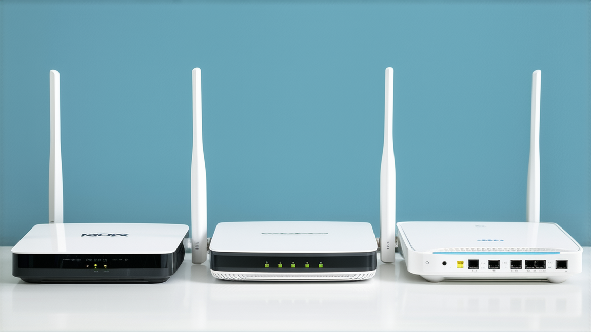

# Izzi vs Totalplay vs Telmex en 2026: cuál conviene según tu tipo de uso

Elegir internet en México no se trata de encontrar “el plan con más megas” ni “la promo más bonita”. Si comparas solo por precio de entrada, puedes terminar con cortes constantes, mala latencia en videollamadas, o una factura más alta de lo que esperabas cuando se acaba la promoción.

La comparación útil entre **Izzi, Totalplay y Telmex** en 2026 tiene que responder esta pregunta:

**¿Cuál me conviene a mí, en mi zona, para mi uso diario y con mi presupuesto real?**

En este artículo vas a encontrar un método para decidir sin adivinar:

- cómo validar cobertura por colonia,
- cómo comparar velocidad real vs velocidad anunciada,
- cómo calcular costo total anual,
- y cómo elegir según tu perfil (home office, gaming, familia, presupuesto ajustado).

Si quieres primero una visión amplia del mercado, revisa el pilar del cluster:  
[Mejor internet para casa en México (2026)](./mejor-internet-casa-mexico-2026)

---

## Metodología de comparación (para no caer en marketing)

Antes de entrar en “quién gana”, definamos una regla: no existe un ganador universal en todo México. En telecom, el rendimiento cambia por infraestructura local, saturación y calidad de atención en cada ciudad.

Para que esta comparativa sea práctica, usamos cinco criterios:

1. **Cobertura real por domicilio**  
   La web puede decir “disponible en tu ciudad”, pero tu calle puede tener otra realidad.

2. **Tecnología y estabilidad**  
   No es igual un plan con fibra bien desplegada que una conexión con más variación en hora pico.

3. **Latencia y consistencia**  
   Si trabajas en remoto o juegas online, esto pesa más que descargar archivos una vez al mes.

4. **Costo total real (12 meses)**  
   Incluye promo, precio normal, instalación, equipo y permanencia.

5. **Soporte y resolución de fallas**  
   A veces el mejor plan no es el más barato, sino el que resuelve incidentes rápido.

Con estos criterios, puedes comparar proveedores de forma objetiva y repetir el método cada vez que cambie una oferta.

---

## Cobertura y tecnología: el filtro que define todo

La mayoría de errores empiezan aquí: contratar por recomendación general (“a mi primo le va bien”) sin validar tu domicilio exacto.

### Qué debes confirmar antes de cotizar

- Cobertura por **código postal + calle + número**
- Si la instalación será por **fibra óptica**
- Tiempo promedio de instalación en tu zona
- Si el módem/router se incluye o tiene costo adicional

### ¿Por qué es tan importante la tecnología?

Porque no solo cambia la velocidad de descarga. También afecta:
- estabilidad de videollamadas,
- subida de archivos,
- comportamiento en horas de alta demanda,
- y sensación general de “internet confiable”.

Si dos planes cuestan parecido, pero uno tiene infraestructura más estable en tu colonia, esa diferencia te ahorra frustración todos los días.

---

## Velocidad anunciada vs experiencia real

Cuando ves “500 Mbps”, en realidad ves un techo comercial. Lo que importa para tu vida diaria es:
- cuánto recibes en horarios pico,
- qué tan constante se mantiene,
- y cómo responde la red cuando hay varios dispositivos conectados.

### Métricas que sí importan

- **Descarga (Mbps):** útil para streaming y navegación pesada.
- **Subida (Mbps):** clave para videollamadas, nube y trabajo remoto.
- **Ping/latencia:** fundamental para juegos y reuniones sin lag.
- **Jitter:** si fluctúa mucho, aparecen cortes o voz robótica.
- **Pérdida de paquetes:** impacta estabilidad general.

### Cómo hacer una prueba útil en casa

1. Corre pruebas 2–3 veces al día por 7 días.
2. Incluye hora pico nocturna.
3. Repite por cable y por Wi‑Fi.
4. Guarda capturas con fecha y hora.

Puedes usar la herramienta oficial del IFT como referencia de medición:  
https://www.ift.org.mx/conocetuvelocidad/

Con esa evidencia tomas decisiones mejores y, si hay incumplimiento, tienes respaldo para reclamar.

---

## Costo real en 12 meses: donde se gana o se pierde dinero

Aquí está el punto donde más gente se equivoca. Una promo agresiva puede verse excelente, pero salir cara cuando sumas todo.

### Qué debes incluir en la cuenta

- Meses con precio promocional
- Meses con precio de lista
- Costo de instalación o activación
- Renta/costo de equipo
- Penalización por cancelación anticipada
- Cargos por no domiciliar (si aplica)

### Fórmula práctica

**Costo real mensual = (total pagado en 12 meses) / 12**

Así comparas proveedores en el mismo terreno.

### Ejemplo sencillo (ilustrativo)

- Proveedor A: promo muy baja 3 meses, luego sube bastante
- Proveedor B: promo menor, pero precio más estable

En anuncios parece que A “gana”, pero en costo anual B puede terminar siendo mejor.

Para un desglose más profundo, enlaza esta guía:  
[Cuánto cuesta el internet en México en 2026](./cuanto-cuesta-internet-en-mexico-2026)

---

## Izzi vs Totalplay vs Telmex por perfil de usuario

Aquí es donde realmente decides. No todos usan internet igual.

## 1) Si haces home office diario

Prioriza:
- estabilidad durante horario laboral,
- buena subida,
- baja latencia,
- soporte que responda rápido.

En este perfil, pagar un poco más por consistencia suele salir más barato que perder horas de trabajo por microcortes.

## 2) Si haces gaming online

Prioriza:
- latencia estable,
- menor jitter,
- comportamiento consistente en hora pico.

Más megas no garantizan mejor experiencia en juego. Un plan con latencia variable te puede arruinar partidas incluso con “alta velocidad”.

## 3) Si en casa son 3–6 personas (streaming + clases + llamadas)

Prioriza:
- equilibrio costo/rendimiento,
- estabilidad en noches,
- condiciones claras de contrato.

Aquí conviene evitar sobrecontratar velocidad solo por miedo. Una configuración equilibrada y estable rinde mejor que pagar por un plan sobredimensionado.

## 4) Si tienes presupuesto ajustado

Prioriza:
- costo real anual,
- claridad de términos,
- posibilidad de salida si el servicio no cumple.

Una promo “baratísima” con permanencia dura puede salir más cara que una tarifa moderada con mejores condiciones.

---

## Mini scorecard para decidir en 15 minutos

Pon una calificación del 1 al 5 para cada proveedor (Izzi, Totalplay, Telmex):

- Cobertura por domicilio
- Estabilidad reportada en tu zona
- Latencia esperada para tu uso
- Costo real mensual (12 meses)
- Calidad de soporte

### Peso sugerido por perfil

**Home office:**
- Estabilidad x3
- Soporte x2
- Subida/latencia x2
- Costo x2
- Cobertura x1

**Gaming:**
- Latencia/jitter x3
- Estabilidad x3
- Costo x2
- Soporte x1
- Cobertura x1

**Familia:**
- Estabilidad x3
- Costo x3
- Cobertura x2
- Soporte x1
- Latencia x1

Con eso conviertes una decisión emocional en una decisión técnica.

---

## Señales de alerta antes de contratar

Si aparece cualquiera de estas, pausa y vuelve a preguntar:

- No te muestran precio sin promoción.
- No aclaran permanencia o penalización.
- No detallan instalación/equipo/costos iniciales.
- “Todo incluido” pero sin condiciones por escrito.
- No te dan folio claro de contratación.

Cuando el contrato es claro desde el inicio, se reducen conflictos después.

---

## Qué hacer si el servicio no cumple

Si ya contrataste y la experiencia es peor de lo prometido:

1. **Documenta evidencia** (velocidad, horarios, fallas).
2. **Abre folio con el proveedor** y guarda número de reporte.
3. **Da oportunidad de corrección** y registra fechas.
4. **Escala si no se resuelve**.

Canal de conciliación oficial de PROFECO (Concilianet):  
https://concilianet.profeco.gob.mx/Concilianet/comoconciliar.jsp

No se trata de “pelear”, se trata de tener proceso y evidencia.

---

## Escenarios reales de decisión (casos prácticos)

Para que la comparativa no se quede en teoría, aquí tienes escenarios típicos.

### Caso 1: pareja en home office (dos videollamadas simultáneas)

**Necesidad principal:** estabilidad y buena subida.  
**Error común:** contratar por descuento del primer mes.

**Método recomendado:**
- Priorizar proveedor con mejor estabilidad local.
- Confirmar tiempos de atención en averías.
- Calcular costo real de 12 meses.

**Resultado esperado:** menos interrupciones y menos riesgo operativo.

### Caso 2: familia de 5 personas con streaming + escuela + trabajo

**Necesidad principal:** rendimiento en hora pico.  
**Error común:** asumir que “más megas siempre = mejor”.

**Método recomendado:**
- Validar congestión nocturna en la colonia.
- Revisar calidad de Wi‑Fi interno (no solo proveedor).
- Ajustar plan al uso promedio y no al extremo ocasional.

**Resultado esperado:** ahorro mensual y experiencia estable.

### Caso 3: gamer competitivo + creador de contenido

**Necesidad principal:** latencia y consistencia.

**Método recomendado:**
- Medir ping y jitter varios días.
- Probar por cable ethernet para aislar problemas de Wi‑Fi.
- Evaluar proveedor por estabilidad, no por marketing de velocidad máxima.

**Resultado esperado:** menos picos de lag y mejor experiencia continua.

---

## Checklist precontratación (imprime y úsalo)

Antes de firmar, confirma estos 15 puntos:

1. Cobertura exacta por domicilio
2. Tipo de tecnología instalada
3. Velocidad de bajada y subida contratada
4. Condiciones de uso justo (si aplica)
5. Precio promocional y duración
6. Precio normal posterior a promoción
7. Costo de instalación/activación
8. Costo/renta de equipo
9. Permanencia mínima
10. Penalización por cancelación
11. Condiciones de pronto pago/domiciliación
12. Tiempo estimado de instalación
13. Canales de soporte (chat/teléfono/app)
14. Tiempo promedio de resolución
15. Folio y contrato por escrito

Con este checklist reduces casi todos los “sorpresas” de factura o servicio.

---

## Preguntas frecuentes (FAQ)

## ¿Cuál es mejor para trabajar desde casa: Izzi, Totalplay o Telmex?

No hay respuesta universal. En home office gana el proveedor con mejor estabilidad local, buena subida y soporte rápido. La prueba por domicilio manda más que la marca.

## ¿Vale la pena pagar más por un plan de mayor velocidad?

Solo si realmente usas esa capacidad. Para muchas casas, pasar de un plan intermedio a uno muy alto no mejora casi nada en experiencia diaria.

## ¿Cómo sé si mi problema es del proveedor o de mi Wi‑Fi?

Haz pruebas por cable directo al módem. Si por cable va bien y por Wi‑Fi mal, el cuello de botella está dentro de casa (router, ubicación, interferencias).

## ¿Es obligatorio quedarse 12 meses?

Depende del contrato. Algunos planes incluyen permanencia con penalización. Debes confirmarlo por escrito antes de contratar.

## ¿Qué hago si no respetan la velocidad contratada?

Documenta mediciones, abre folio, da ventana de solución y escala por canal formal si no corrigen.

---

## Errores estratégicos que debes evitar

- Elegir por recomendación genérica sin validar tu colonia.
- Ignorar costo real después de promoción.
- No pedir condiciones de permanencia por escrito.
- No tener un proceso de medición durante el primer mes.
- Esperar demasiado para reportar problemas.

Evitar estos errores suele tener más impacto que “buscar la mejor promo”.

---

## Plan de acción en 24 horas para tomar decisión

**Hora 1:** valida cobertura exacta de los 3 proveedores.  
**Hora 2:** solicita cotización completa por 12 meses.  
**Hora 3:** aplica scorecard y pesos según tu perfil.  
**Hora 4:** elige proveedor con mejor puntaje total.

Luego:
- agenda instalación,
- mide 7 días,
- y documenta para poder reclamar si hay incumplimiento.

Este método te permite decidir rápido sin improvisar.

---

## Conclusión: cuál conviene realmente en 2026

La respuesta corta:
- **Totalplay** suele destacar donde su infraestructura local está fuerte y buscas consistencia.
- **Telmex** suele ser opción sólida en zonas con buena cobertura y continuidad.
- **Izzi** puede ser competitivo en precio, siempre que valides rendimiento local y costo final.

La respuesta correcta para ti:

**El que mejor puntaje te dé en cobertura real + estabilidad + costo total para tu perfil.**

No compres por anuncio; compra por rendimiento esperado en tu domicilio.

---

## Internal links del cluster

- Pilar principal: [Mejor internet para casa en México (2026)](./mejor-internet-casa-mexico-2026)
- Guía de costos: [Cuánto cuesta el internet en México en 2026](./cuanto-cuesta-internet-en-mexico-2026)

---

## Recomendación editorial para actualizar este artículo cada trimestre

Para mantener el ranking y la utilidad de esta comparativa en 2026, conviene actualizar estos bloques cada 90 días:

1. **Precios y promociones vigentes** de los tres proveedores.
2. **Cambios de condiciones** (permanencia, instalación, bonos, descuentos).
3. **Cobertura nueva de fibra** en ciudades y zonas de alto crecimiento.
4. **Sección FAQ** con dudas que más se repiten en Search Console.

Además, cada actualización debería:
- conservar el slug (para no perder autoridad),
- ajustar `dateModified`,
- y añadir 1–2 enlaces internos nuevos desde artículos recientes del mismo pilar.

Esto ayuda a que Google vea la página como contenido vivo y útil, no como una comparativa estática.

---

## Guía rápida de implementación técnica para tu decisión final

Si quieres convertir esta guía en una decisión ejecutable hoy mismo, usa este mini flujo:

- **Paso 1:** haz shortlist de Izzi/Totalplay/Telmex con cobertura confirmada.
- **Paso 2:** calcula costo real 12 meses en una hoja simple.
- **Paso 3:** aplica scorecard con peso por perfil.
- **Paso 4:** contrata el mejor puntaje y define fecha de revisión en 7 días.
- **Paso 5:** si hay incumplimiento, abre folio en menos de 24 horas.

Con este sistema, dejas de decidir por impulso y empiezas a decidir por datos.

---

## Fuentes consultadas (actualizado 2026)

- Totalplay paquetes: https://www.totalplay.com.mx/paquetes
- Telmex paquetes hogar: https://telmex.com/web/hogar/paquetes-de-internet
- izzi home/paquetes: https://www.izzi.mx/home/
- IFT Conoce tu velocidad: https://www.ift.org.mx/conocetuvelocidad/
- IFT (diagnósticos/comunicados): https://www.ift.org.mx/
- PROFECO Concilianet: https://concilianet.profeco.gob.mx/Concilianet/comoconciliar.jsp
