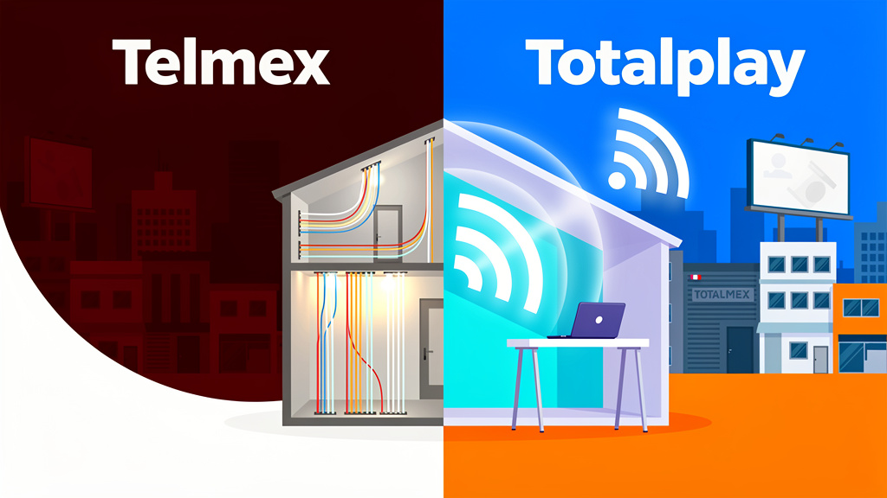
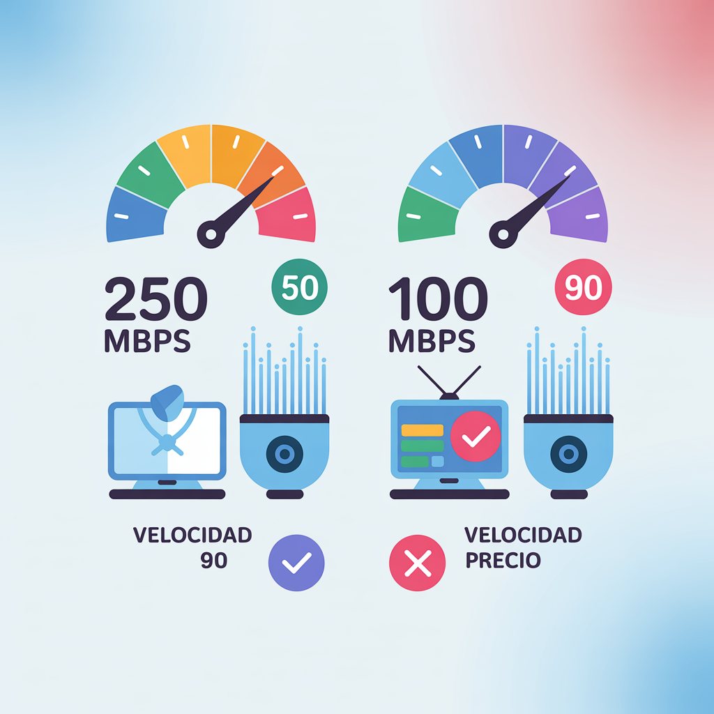
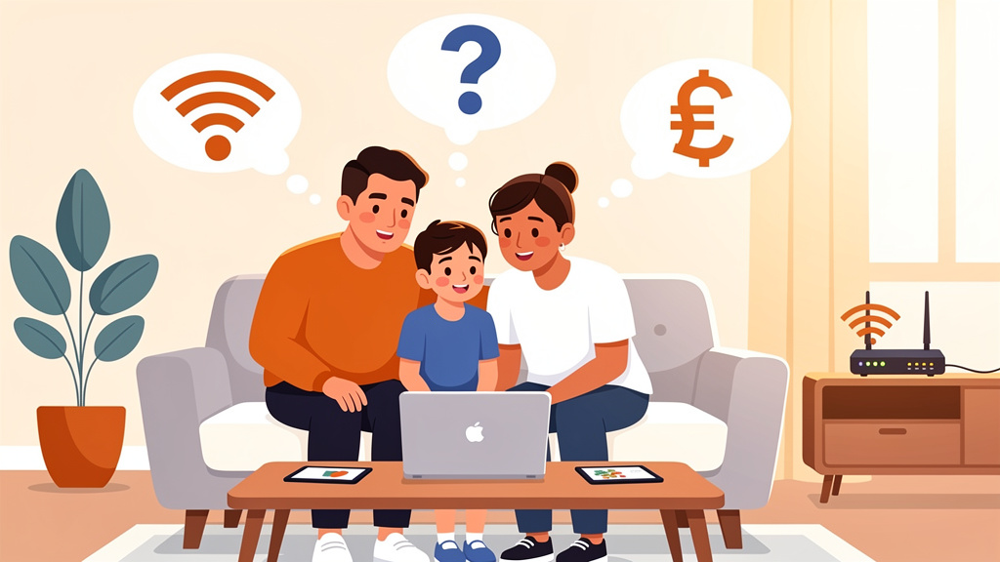

<h1>Telmex vs Totalplay 2026: precio real, velocidad y cuál conviene más</h1>
    <figure class="article-image">
  <!-- IMAGE: hero -->
  
</figure>

    

        
Si estás en 2026 buscando cambiar de proveedor de internet o renovar tu contrato, la duda sigue siendo la misma: <strong>Telmex vs Totalplay</strong>. Aunque el mercado ha madurado, ambas empresas siguen dominando el 60% del mercado residencial. La respuesta corta es: <em>Telmex suele ganar por precio y cobertura rural, mientras que Totalplay gana por tecnología y experiencia de usuario.</em> Si no sabes por dónde empezar, te recomendamos leer nuestra guía completa sobre <a href="/blog/01-mejor-internet-casa-mexico-2026">cómo elegir el mejor internet para tu casa</a>.

    

    <h2>Resumen rápido: diferencias clave</h2>
    <figure class="article-image">
  <!-- IMAGE: comparison-table -->
  
</figure>
    
    
A continuación, te presentamos una tabla comparativa directa para que veas de un vistazo las diferencias fundamentales que marcarán tu decisión:

    <table>
        <thead>
            <tr>
                <th>Característica</th>
                <th>Telmex</th>
                <th>Totalplay</th>
            </tr>
        </thead>
        <tbody>
            <tr>
                <td><strong>Velocidad Mínima</strong></td>
                <td>250 Mbps (Promedio)</td>
                <td>100 Mbps (Promedio)</td>
            </tr>
            <tr>
                <td><strong>Precio Entrada</strong></td>
                <td>~$250 MXN / mes</td>
                <td>~$390 MXN / mes</td>
            </tr>
            <tr>
                <td><strong>Tecnología</strong></td>
                <td>Fibra + Cobre</td>
                <td>Fibra Pura</td>
            </tr>
            <tr>
                <td><strong>Televisión</strong></td>
                <td>No incluida (Dish opcional)</td>
                <td>Sí (185 canales)</td>
            </tr>
            <tr>
                <td><strong>Cobertura Rural</strong></td>
                <td>Alta</td>
                <td>Media</td>
            </tr>
            <tr>
                <td><strong>Teléfono Fijo</strong></td>
                <td>Opcional</td>
                <td>Siempre incluido</td>
            </tr>
        </tbody>
    </table>

    <h2>Planes y precios Telmex 2026</h2>

    
Telmex ha mantenido su estrategia de precios agresivos, especialmente en su plan básico. A diferencia de sus competidores, Telmex a menudo ofrece paquetes híbridos que combinan internet con servicios de voz y antivirus, lo cual es atractivo para familias que buscan economía.

    <h3>Plan básico (~$250-389/mes)</h3>
    
Este es el plan que suele arrastrar a la competencia. Con una velocidad real que ronda los 250 Mbps, es más que suficiente para streaming en 4K y trabajo remoto ligero. Lo que suele diferenciar este plan en 2026 es que incluye antivirus Claro y una línea telefónica básica, lo que lo hace muy competitivo si necesitas ahorro.

    <h3>Plan intermedio (~$499/mes)</h3>
    
Para los que necesitan más potencia, el plan intermedio sube la velocidad a niveles donde la fibra de Totalplay empieza a sentirse justa. Aquí es donde Telmex suele aplicar descuentos por permanencia, algo que ha sido clave para retener a clientes que ya tienen contratada la televisión de Dish Network.

    <h3>Qué incluye realmente (Claro Video, antivirus, Dish opcional)</h3>
    
Es vital leer la letra pequeña. Telmex vende internet, pero su ecosistema se basa en Claro Video y Claro TV (a través de Dish). Si no eres usuario de Claro, el plan de internet puro puede sentirse limitado en funciones adicionales como la app de control parental avanzada o almacenamiento en la nube, que Totalplay suele incluir de serie en sus planes de fibra.

    <h2>Planes y precios Totalplay 2026</h2>

    
Totalplay se ha posicionado como la opción "premium" para el hogar moderno. Su enfoque es ofrecer la mejor experiencia tecnológica, aunque con un precio que suele ser un 20% más alto que el de Telmex.

    <h3>Plan básico (desde ~$390/mes, 100Mbps)</h3>
    
Aunque el precio es más alto que el de Telmex, el plan básico de Totalplay promete <strong>fibra pura</strong> hasta el hogar. Esto significa menos interferencias y estabilidad en la señal. A pesar de empezar en 100 Mbps, la tecnología Totalplay suele ofrecer una latencia más baja que la red híbrida de cobre de Telmex.

    <h3>Plan premium ($2,999/mes, 10,000Mbps, Wi-Fi 7, Apple TV+)</h3>
    
Este es el plan estrella de 2026. Con 10 Gigabits de velocidad, Wi-Fi 7 de última generación y la inclusión de Apple TV+, Totalplay ataca directamente al segmento de hogares tecnológicos. Si tienes múltiples dispositivos, consolas de última generación y trabajas con transferencias de archivos pesados, este plan es una locura de velocidad por un precio que ha bajado gracias a la competencia.

    <h3>Qué incluye realmente (advertir sobre subidas de precio sin aviso)</h3>
    
Un punto de atención en 2026 ha sido la estabilidad de precios. Los usuarios reportan que Totalplay ha realizado subidas de precio sin un aviso previo claro en algunos casos, especialmente cuando se renueva el contrato. Asegúrate de revisar el contrato anual para evitar sorpresas.

    <h2>Velocidad real: fibra vs cobre</h2>
    
La batalla tecnológica es la más importante. Telmex utiliza una red híbrida: fibra óptica en tramos largos y cobre en la última milla hasta tu casa. Totalplay, por su parte, apuesta por la fibra pura.

    
En zonas urbanas de CDMX, Guadalajara y Monterrey, la diferencia es mínima. Sin embargo, en zonas donde la infraestructura de cobre de Telmex es más antigua, la velocidad real puede caer drásticamente durante la hora pico. Si buscas la máxima estabilidad, la guía de <a href="/blog/02-izzi-vs-totalplay-vs-telmex-2026">comparativa completa de los 4 grandes ISPs</a> te dará más detalles sobre cómo se comportan estas redes bajo presión.

    <h2>Cobertura: ¿cuál llega a tu zona?</h2>
    
La cobertura es el factor decisivo para muchos.

    <ul>
        <li><strong>CDMX, GDL, MTY y ciudades principales:</strong> Ambas empresas ofrecen una cobertura excelente. Totalplay suele tener mejor señal en fraccionamientos nuevos y privados.</li>
        <li><strong>Cobertura Rural:</strong> Aquí Telmex gana por goleada. Si vives en una colonia o municipio donde no llega la fibra, Telmex suele ser la única opción viable con tecnología de cobre.</li>
    </ul>
    
En 2026, Totalplay ha expandido su red a más de 30 ciudades, pero Telmex sigue siendo la red más extensa en el interior de la República.

    <h2>Para gaming y home office: ¿cuál gana?</h2>
    
Si tu prioridad es jugar online o hacer videollamadas profesionales, la estabilidad es clave.

    <ul>
        <li><strong>Home Office:</strong> La fibra pura de Totalplay suele ofrecer una latencia más baja y constante, lo que es ideal para Zoom y Google Meet. Telmex es competente, pero su red híbrida puede presentar micro-cortes si la señal del cobre se ve afectada por la lluvia o interferencias.</li>
        <li><strong>Gaming:</strong> Para el gamer que juega en consola, Totalplay suele ganar por ofrecer mejor soporte técnico y configuración de router. Sin embargo, si el ping es bajo en ambas, el plan de 250 Mbps de Telmex es más económico para mantener una conexión estable.</li>
    </ul>
    
Para profundizar en qué router o plan usar, consulta nuestra guía de <a href="/blog/04-mejor-internet-home-office-mexico-2026">internet para home office</a>.

    <h2>Cancelación y permanencia: la letra chiquita</h2>
    
En 2026, la retención de clientes ha vuelto a ser el foco de ambas empresas.

    <ul>
        <li><strong>Telmex:</strong> Ofrece descuentos por permanencia de hasta 6 meses en su plan intermedio. La cancelación suele requerir 30 días de aviso por escrito.</li>
        <li><strong>Totalplay:</strong> También ofrece descuentos, pero se centra más en la fidelización mediante la integración de servicios. La cancelación puede ser más burocrática si tienes activos de televisión o teléfono.</li>
    </ul>

    <h2>¿Cuál te conviene según tu caso?</h2>
    
Para ayudarte a decidir, hemos creado esta mini-guía:

    

        <ul>
            <li><strong>Si eres Gamer:</strong> Ve por <strong>Totalplay</strong> (fibra pura) o un plan de 250+ Mbps de Telmex si el precio es tu prioridad.</li>
            <li><strong>Si trabajas desde casa:</strong> <strong>Totalplay</strong> suele ser más estable para videollamadas.</li>
            <li><strong>Si vives en una zona rural:</strong> <strong>Telmex</strong> es prácticamente la única opción viable.</li>
            <li><strong>Si buscas ahorrar dinero:</strong> El plan básico de <strong>Telmex</strong> (~$250) es el más económico del mercado.</li>
            <li><strong>Si quieres TV integrada:</strong> <strong>Totalplay</strong> ofrece 185 canales en una sola cuenta.</li>
        </ul>
    

    <h2>Preguntas frecuentes</h2>
    <figure class="article-image">
  <!-- IMAGE: faq-illustration -->
  
</figure>

    

        <h3>¿Totalplay es mejor que Telmex?</h3>
        
Depende de qué priorices. Si valoras la tecnología, la estabilidad y la integración de servicios de TV, Totalplay suele ser mejor. Si buscas el mejor precio y tienes buena cobertura en tu zona, Telmex es la opción más lógica y económica.

    

    

        <h3>¿Cuánto cuesta Totalplay en 2026?</h3>
        
Los planes más económicos de Totalplay comienzan alrededor de los $390 pesos mensuales por 100 Mbps de fibra. Sin embargo, si buscas lo mejor del mercado, el plan premium de 10,000 Mbps con Wi-Fi 7 ronda los $3,000 pesos.

    

    

        <h3>¿Cuánto cuesta Telmex internet en 2026?</h3>
        
El plan básico de internet solo de Telmex suele rondar los $250 pesos, aunque los paquetes que incluyen antivirus y teléfono pueden llegar hasta los $389 pesos, mientras que el plan intermedio supera los $499 pesos.

    

    

        <h3>¿Cuál tiene mejor velocidad, Telmex o Totalplay?</h3>
        
En teoría, ambos ofrecen velocidades similares en sus planes equivalentes. Sin embargo, dado que Totalplay es 100% fibra, su velocidad real es más constante. Telmex, al usar cobre en algunos tramos, puede ver su velocidad caer si la infraestructura local no está actualizada.

    

