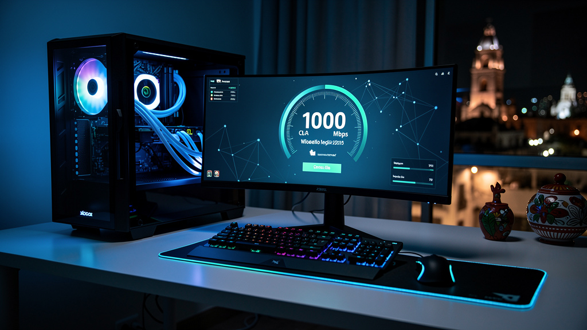
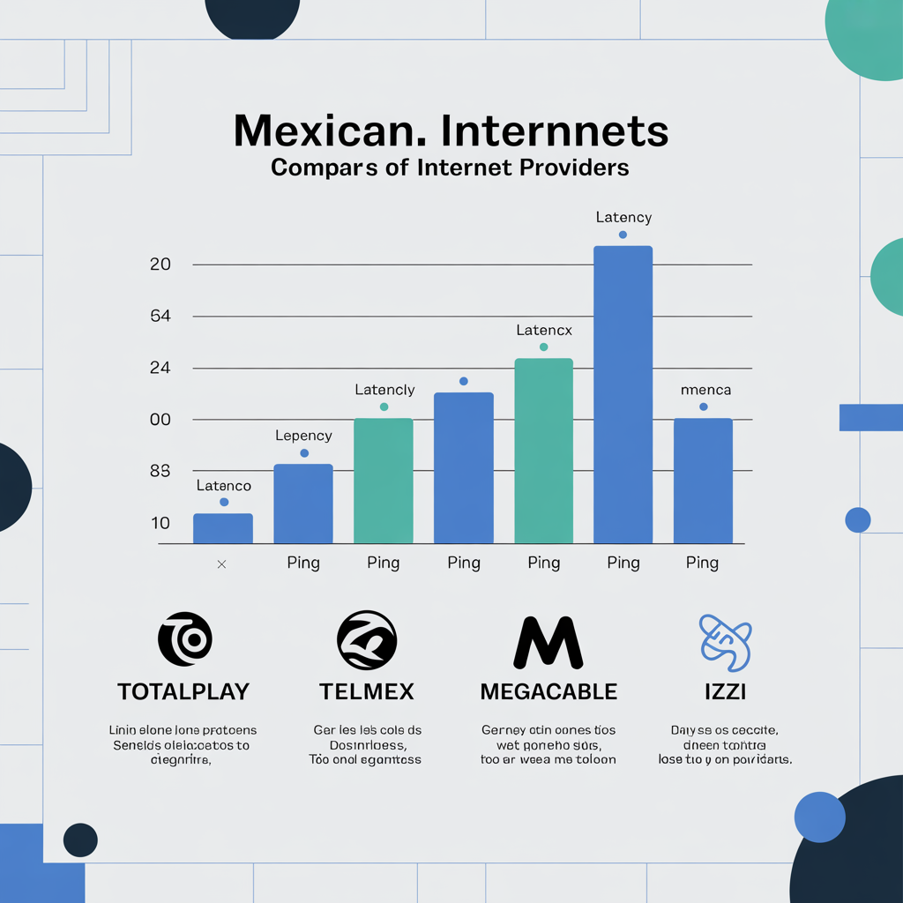

# Mejor Internet para Gaming en México 2026: ¿Cuál ISP Te Da Menos Lag?

Si juegas en línea, sabes que una conexión lenta o con alta latencia puede arruinar una partida completa. No importa si tienes el mejor equipo del mercado: si tu internet tiene 150ms de ping, perderás contra alguien con 20ms. En México, no todos los proveedores de internet son iguales cuando se trata de gaming.

En esta guía comparamos los principales ISPs de México en 2026 —Totalplay, Telmex, Megacable e Izzi— analizando exactamente lo que los gamers necesitan: latencia real, estabilidad, velocidad de subida y precio. No te damos el discurso de ventas de las operadoras; te damos los datos.

---

## ¿Qué Necesitas Realmente para Jugar Online sin Lag?

Antes de comparar proveedores, hay que entender qué métricas importan para gaming. Muchos usuarios pagan por velocidades altísimas cuando lo que realmente necesitan es estabilidad y baja latencia.

**Las métricas clave para gaming:**

- **Latencia (ping):** El tiempo en milisegundos que tarda un paquete de datos en ir y volver. Para gaming competitivo, busca menos de 50ms. Menos de 20ms es excelente.
- **Jitter:** La variación de la latencia. Un ping promedio de 30ms pero que sube a 100ms en momentos de carga es peor que un ping estable de 45ms.
- **Velocidad de bajada:** Para la mayoría de los juegos online, 25 Mbps son suficientes. Sin embargo, si descargas actualizaciones grandes o usas streaming simultáneo, querrás 100 Mbps o más.
- **Velocidad de subida:** Para streaming en vivo (Twitch, YouTube Gaming), necesitas al menos 5-10 Mbps de subida estable.
- **Estabilidad:** Los paquetes perdidos (packet loss) matan partidas. Un 1% de pérdida de paquetes puede hacer que un juego en línea sea injugable.

**¿Cuántos Mbps necesitas según el juego?**

| Juego | Velocidad mínima | Latencia ideal |
|-------|-----------------|----------------|
| Fortnite / Warzone | 15 Mbps | < 50ms |
| FIFA / EA Sports FC | 10 Mbps | < 30ms |
| League of Legends / Dota 2 | 5 Mbps | < 40ms |
| Streaming en Twitch (720p) | 10 Mbps subida | < 50ms |
| Descargas rápidas (Steam) | 100+ Mbps | No crítica |

---

## Comparativa de ISPs para Gaming en México 2026

Esta es la tabla que más te importa. Los datos de latencia provienen de mediciones independientes de Ookla Speedtest y reportes de dplnews de febrero 2026:

| ISP | Latencia Promedio | Tecnología | Velocidad Máxima | Precio desde | Veredicto Gaming |
|-----|------------------|------------|-----------------|--------------|-----------------|
| **Totalplay** | 26–36 ms | Fibra óptica | 1 Gbps | ~$399/mes | ⭐⭐⭐⭐⭐ Mejor opción |
| **Megacable** | 10–51 ms* | Coaxial + Fibra | 600 Mbps | ~$399/mes | ⭐⭐⭐⭐ Muy bueno |
| **Telmex Infinitum** | 40 ms | Fibra óptica | 1 Gbps | ~$449/mes | ⭐⭐⭐ Bueno |
| **Izzi** | 50 ms+ | Cable coaxial | 400 Mbps | ~$379/mes | ⭐⭐ Aceptable |

*Megacable reportó 10.27ms en mediciones de febrero 2026 en zonas con fibra, pero su promedio nacional es mayor en zonas con coaxial.

**Resumen rápido:** Para gaming competitivo, Totalplay es la elección más consistente a nivel nacional gracias a su red 100% fibra óptica. Megacable puede ser igual o mejor en zonas donde ya instalaron fibra. Telmex es sólido pero más caro. Izzi es la opción más económica, pero con mayor latencia.

---

## Totalplay: El Rey del Gaming en México

Totalplay ha consolidado su posición como el mejor ISP de México para gaming según múltiples reportes de Ookla. Su red es 100% fibra óptica, lo que se traduce en menor latencia, menos interferencias y mayor estabilidad que las redes de cable coaxial.

**Ventajas de Totalplay para gaming:**
- Red de fibra óptica de extremo a extremo (mejor estabilidad)
- Latencia promedio de 26ms (la más baja entre ISPs nacionales según Ookla)
- Velocidad de descarga líder en México (349.69 Mbps en promedio según mediciones 2026)
- Baja pérdida de paquetes reportada por usuarios en foros como r/mexico y r/ayudamexico
- Disponible en la mayoría de las ciudades principales del país

**Desventajas:**
- Cobertura aún limitada en zonas semi-rurales
- Permanencia de 12 meses en la mayoría de contratos
- Soporte al cliente con calificaciones mixtas

**Planes recomendados para gaming:**
- **100 Mbps:** Desde ~$399/mes — ideal para 1-2 gamers en casa
- **200 Mbps:** Desde ~$499/mes — para familias que usan streaming y gaming simultáneamente
- **500 Mbps:** Para streamers o casas con muchos dispositivos

Si juegas títulos competitivos como Valorant, Warzone o FIFA y vives en una zona con cobertura Totalplay, este debería ser tu primer candidato.

> Compara Totalplay vs Telmex en detalle: [Telmex vs Totalplay México 2026](/blog/telmex-vs-totalplay-mexico-2026)

---

## Telmex Infinitum para Gamers en 2026

Telmex ha evolucionado significativamente en los últimos años. Su red de fibra óptica, donde está disponible, ofrece latencias de alrededor de 40ms —más alta que Totalplay, pero suficiente para la mayoría de los jugadores no profesionales.

**Ventajas de Telmex para gaming:**
- Cobertura nacional superior a todos los otros ISPs
- Disponible en zonas donde Totalplay y Megacable no llegan
- Planes de fibra óptica hasta 1 Gbps en ciudades principales
- Estabilidad históricamente sólida en zonas urbanas

**Desventajas:**
- Precio más alto que competidores (~$449/mes por 100 Mbps)
- Latencia 40ms en promedio — aceptable pero no óptima para esports competitivos
- En zonas que aún tienen ADSL (cobre), la experiencia de gaming es notablemente peor

**¿Cuándo elegir Telmex?**
Si vives en una zona donde Totalplay no tiene cobertura, Telmex Infinitum con fibra óptica es la segunda mejor opción. Si te ofrecen ADSL (velocidades inferiores a 20 Mbps), considera seriamente esperar la instalación de fibra o explorar Megacable.

---

## Megacable e Izzi: ¿Valen para Gaming?

### Megacable

Megacable presenta una situación interesante en 2026. Según datos de dplnews de febrero 2026, en zonas con su nueva infraestructura de fibra, registró la latencia más baja de todos los ISPs: 10.27ms. Sin embargo, gran parte de su red todavía usa cable coaxial, donde la latencia sube a 50ms o más.

**Para gaming, Megacable es una buena opción si:**
- Tu zona ya tiene cobertura de fibra Megacable (consultar en su sitio web)
- El plan incluye garantía de velocidad y baja latencia
- El precio competitivo (~$399/mes por 100 Mbps) es importante para ti

**Advertencia:** Antes de contratar Megacable para gaming, verifica específicamente si tu dirección tiene fibra o coaxial. La diferencia en experiencia de juego es significativa.

### Izzi

Izzi opera principalmente con cable coaxial, lo que resulta en latencias típicamente superiores a 50ms. Para gaming casual —jugar FIFA con amigos o partidas de Minecraft— es perfectamente funcional. Para gaming competitivo con rankings o torneos, la latencia más alta puede ser un problema.

**Izzi funciona bien para:**
- Gaming casual (no competitivo)
- Casas donde el gaming no es la prioridad principal
- Zonas donde no hay otra opción disponible

---

## Consejos para Reducir Tu Ping Sin Cambiar de ISP

Si estás atascado con tu ISP actual o quieres exprimir al máximo tu conexión, estos consejos pueden reducir tu ping entre 10 y 40ms:

**1. Usa cable ethernet, no WiFi**
La conexión por cable elimina la interferencia inalámbrica. Un WiFi de 5GHz puede agregar 5-20ms de latencia adicional y mayor jitter. Invierte en un cable Cat6 o Cat7 — cuesta menos de $200 pesos en MercadoLibre.

**2. Juega en horarios de baja congestión**
Entre las 7 PM y las 11 PM, las redes residenciales están sobrecargadas. Si puedes, juega en la mañana o a media tarde. La diferencia puede ser de 10-30ms.

**3. Usa el servidor de juego más cercano**
La mayoría de los juegos permiten seleccionar el servidor de conexión. Para México, los servidores de Dallas TX o Miami FL suelen dar mejor ping que servidores europeos.

**4. Actualiza tu router**
Un router de gama baja introduce latencia adicional. Si tu router tiene más de 4 años, considera cambiarlo. Modelos con QoS (Quality of Service) pueden priorizar el tráfico de gaming sobre streaming o descargas.

**5. Cierra aplicaciones en segundo plano**
Actualizaciones de Windows, respaldos en la nube o descargas de Steam pueden consumir ancho de banda y aumentar el jitter. Ciérralos antes de jugar.

> ¿Quieres saber cuánto pagas realmente? Revisa: [¿Cuánto cuesta internet en México en 2026?](/blog/cuanto-cuesta-internet-en-mexico-2026)

---

## Preguntas Frecuentes sobre Internet para Gaming en México

**¿Cuántos Mbps necesito para jugar Fortnite o Warzone sin lag?**

Para jugar Fortnite o Warzone sin problemas, necesitas un mínimo de 15-25 Mbps de bajada. Sin embargo, la velocidad no es el factor más crítico —lo es la latencia. Con 25 Mbps y 30ms de ping juegas mejor que con 100 Mbps y 80ms de ping.

**¿Cuál ISP tiene el menor ping en México en 2026?**

Según datos de Ookla y reportes independientes de 2026, Totalplay tiene consistentemente la latencia más baja a nivel nacional con un promedio de 26-36ms. Megacable registró 10.27ms en zonas con fibra óptica en febrero 2026, aunque esta cifra no es representativa de toda su red.

**¿Es mejor la fibra óptica o el cable coaxial para gaming?**

La fibra óptica es superior para gaming en prácticamente todos los aspectos: menor latencia, más estabilidad, menos interferencias y mejor simetría de velocidad (subida similar a bajada). El cable coaxial puede ser suficiente para gaming casual, pero para gaming competitivo, la fibra marca una diferencia real.

**¿El WiFi afecta mi ping en los videojuegos?**

Sí, el WiFi añade entre 5ms y 30ms de latencia adicional comparado con ethernet, dependiendo del router, distancia y congestión de la señal. También aumenta el jitter (variación de latencia), que es especialmente dañino en juegos rápidos como shooters. Si puedes, usa siempre cable ethernet para gaming.

**¿Qué plan de internet es el más económico para gaming en México?**

Para gaming, el plan más económico que funciona bien es 100 Mbps de Izzi o Megacable (~$379-399/mes). Sin embargo, si priorizas la latencia sobre el precio, Totalplay 100 Mbps (~$399/mes) ofrece mejor experiencia. Evita planes de menos de 50 Mbps si descargás actualizaciones grandes o juegas con más personas en casa.

---

## Conclusión: ¿Cuál Internet Contratar para Gaming?

**Elige Totalplay** si está disponible en tu zona y el gaming es importante para ti. Su red de fibra óptica y latencia consistente de 26ms lo hacen la mejor opción general.

**Elige Megacable** si ofrecen fibra óptica en tu dirección específica y quieres comparar precios antes de decidir.

**Elige Telmex** si Totalplay no tiene cobertura en tu zona y necesitas fibra óptica confiable.

**Elige Izzi** si el presupuesto es la prioridad y juegas de manera casual —no competitiva.

Antes de contratar cualquier plan, verifica la disponibilidad real en tu dirección. Los ISPs en México tienen coberturas muy variables incluso dentro de la misma colonia. Usa las herramientas de verificación de cobertura en sus sitios web o llama directamente para confirmar que tu zona tiene fibra óptica disponible.

> Compara más opciones en: [Mejor Internet para Casa en México 2026](/blog/mejor-internet-casa-mexico-2026)
