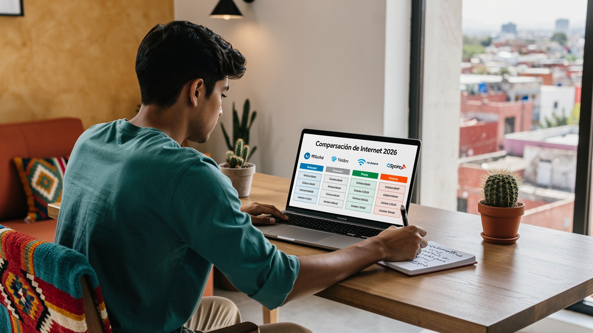

# ¿Cuánto Cuesta Internet en México en 2026? Guía de Precios Reales

Si estás buscando contratar internet en casa, la primera pregunta siempre es la misma: ¿cuánto voy a pagar? Pero la respuesta no es tan simple como el número que aparece en el anuncio. En México, el costo real de internet incluye la mensualidad, el cargo de instalación, la permanencia y las condiciones de renovación. En esta guía desglosamos los precios reales de los principales ISPs en 2026 para que no haya sorpresas.

---

## Resumen Rápido: Precios de Internet en México 2026

Antes del análisis completo, aquí tienes la tabla comparativa de planes básicos y medianos (100 Mbps) para tener un punto de comparación:

| ISP | Plan 100 Mbps | Plan 200 Mbps | Instalación | Permanencia | Tecnología |
|-----|--------------|--------------|-------------|-------------|------------|
| **Telmex Infinitum** | ~$449/mes | ~$599/mes | $0–$799 | 12 meses | Fibra óptica |
| **Totalplay** | ~$399/mes | ~$499/mes | $0 (promo) | 12 meses | Fibra óptica |
| **Megacable** | ~$399/mes | ~$499/mes | $0 (promo) | Sin permanencia | Coaxial / Fibra |
| **Izzi** | ~$379/mes | ~$469/mes | $0 (promo) | 6–12 meses | Cable coaxial |
| **CFE Internet** | Variable | N/D | Variable | Sin permanencia | Variable |

*Precios aproximados en pesos mexicanos (MXN) incluyendo IVA. Varían por zona y promoción vigente.*

---

## Telmex Infinitum: Precios y Planes 2026

Telmex es el ISP con mayor cobertura nacional en México y uno de los más establecidos. Sin embargo, sus precios son generalmente más altos que los de sus competidores para velocidades equivalentes.

**Planes residenciales actuales:**

| Plan | Velocidad | Precio mensual aprox. |
|------|-----------|----------------------|
| Básico | 50 Mbps | ~$349/mes |
| Estándar | 100 Mbps | ~$449/mes |
| Avanzado | 200 Mbps | ~$599/mes |
| Fibra 500 | 500 Mbps | ~$899/mes |
| Fibra 1 GB | 1 Gbps | ~$1,299/mes |

**Cargos adicionales a considerar:**
- **Instalación:** Puede ser $0 en promoción, pero fuera de promo puede llegar a $799 MXN
- **Permanencia:** Generalmente 12 meses; penalización por cancelación anticipada
- **Cargo por equipo (módem):** Incluido en la mensualidad en mayoría de planes

**¿Cuándo elegir Telmex?** Si vives en una zona donde Totalplay y Megacable no tienen cobertura, Telmex es la opción más confiable. En zonas con fibra óptica disponible, su rendimiento es comparable al de Totalplay.

---

## Totalplay: Precios y Planes 2026

Totalplay ha emergido como el ISP con mejor relación precio-rendimiento en México en 2026, con la mayor velocidad promedio de bajada según mediciones independientes.

**Planes residenciales actuales:**

| Plan | Velocidad | Precio mensual aprox. |
|------|-----------|----------------------|
| Básico | 100 Mbps | ~$399/mes |
| Estándar | 200 Mbps | ~$499/mes |
| Avanzado | 500 Mbps | ~$699/mes |
| Ultra | 1 Gbps | ~$999/mes |

**Cargos adicionales:**
- **Instalación:** $0 en la mayoría de promociones actuales
- **Permanencia:** 12 meses generalmente; verificar condiciones al contratar
- **Fibra 100%:** Toda la red de Totalplay es fibra óptica

**¿Cuándo elegir Totalplay?** Es la primera opción a considerar si tienes cobertura disponible en tu dirección. Mejor latencia promedio para gaming y trabajo remoto que sus competidores de coaxial.

> Compara en detalle: [Telmex vs Totalplay México 2026](/blog/telmex-vs-totalplay-mexico-2026)

---

## Megacable: Precios y Planes 2026

Megacable opera principalmente con cable coaxial (aunque está expandiendo su red de fibra). Sus precios son competitivos y en algunas zonas tiene la ventaja de no requerir permanencia obligatoria.

**Planes residenciales actuales:**

| Plan | Velocidad | Precio mensual aprox. |
|------|-----------|----------------------|
| Básico | 50 Mbps | ~$299/mes |
| Estándar | 100 Mbps | ~$399/mes |
| Avanzado | 200 Mbps | ~$499/mes |
| Plus | 400 Mbps | ~$699/mes |

**Cargos adicionales:**
- **Instalación:** Frecuentemente $0 en promociones
- **Permanencia:** Varía — algunos planes no tienen permanencia
- **Paquetes con TV:** Megacable es popular por sus paquetes internet+TV

**¿Cuándo elegir Megacable?** Buena opción si quieres precio competitivo y no quieres comprometerte con permanencia. En zonas donde ya instalaron fibra, puede ser la opción de menor latencia. En zonas coaxial, rendimiento aceptable para uso doméstico.

---

## Izzi: Precios y Planes 2026

Izzi es el ISP más económico en el segmento de 100 Mbps y a menudo incluye beneficios adicionales como televisión, línea móvil y servicios de streaming en sus paquetes.

**Planes residenciales actuales:**

| Plan | Velocidad (descarga) | Precio mensual aprox. |
|------|----------------------|----------------------|
| Básico | 30 Mbps | ~$279/mes |
| Estándar | 100 Mbps | ~$379/mes |
| Avanzado | 200 Mbps | ~$469/mes |
| Plus | 400 Mbps | ~$699/mes |

**Paquete especial (100 Mbps + TV + extras):** ~$760/mes — incluye 200 canales de TV, Izzi Móvil con 5 GB, ViX Premium, Max, Sky Sports, LaLiga y Bundesliga según datos de El Informador.

**Cargos adicionales:**
- **Instalación:** $0 en la mayoría de promociones
- **Permanencia:** 6 a 12 meses dependiendo del plan
- **Tecnología:** Cable coaxial en la gran mayoría de su red

**¿Cuándo elegir Izzi?** Si el presupuesto es la prioridad y no necesitas la menor latencia posible, Izzi ofrece el mayor valor en términos de precio/servicios incluidos. Para uso casual (streaming, redes sociales, videollamadas) funciona bien.

---

## El Costo Real: Lo Que No Aparece en el Anuncio

Los precios que ves en publicidad son solo el punto de partida. Antes de contratar, considera estos costos ocultos:

### 1. Cargo de instalación

Aunque muchos ISPs ofrecen instalación gratuita en promociones, esto puede cambiar después de cierto plazo. Verifica si el cargo de instalación aplica o no en tu caso y si hay condición de permanencia asociada.

### 2. Renta del equipo (módem/router)

Algunos planes incluyen el equipo en la mensualidad. Otros cobran un cargo mensual adicional por renta de equipo ($50–$150/mes). Pregunta explícitamente si el equipo está incluido o si hay cargo adicional.

### 3. Penalización por cancelación anticipada

Si cancelas antes de que termine el periodo de permanencia, la penalización puede ser de 1 a 3 meses de mensualidad. Revisa el contrato antes de firmar.

### 4. Cambios de precio después de promoción

Muchos ISPs ofrecen precios introductorios por 3–6 meses que luego suben. El precio "desde $399" puede convertirse en $549 al sexto mes. Pregunta cuál es el precio después del periodo de promoción.

### 5. IVA incluido o no

Confirma si el precio anunciado incluye o no el 16% de IVA. En México, los precios de internet siempre deben publicarse con IVA incluido, pero en algunos comparadores o folletos aparece el precio antes de impuestos.

---

## ¿Cuánto Cuesta Realmente Internet en México al Mes?

Tomando en cuenta promociones vigentes y cargos reales para uso doméstico típico (100 Mbps), el rango real en 2026 es:

- **Mínimo posible:** ~$279/mes (Izzi 30 Mbps, plan básico)
- **Rango más común para 100 Mbps:** $379–$449/mes
- **Plan robusto con fibra óptica:** $499–$699/mes para 200–500 Mbps
- **Planes premium (1 Gbps):** $999–$1,299/mes

El promedio nacional para contrato residencial activo se estima entre $400 y $500 pesos mensuales para la velocidad más contratada (100 Mbps).

---

## ¿Cómo Comparar Planes de Internet Antes de Contratar?

Antes de firmar cualquier contrato, sigue estos pasos para tomar la mejor decisión para tu colonia y uso:

### Paso 1: Verifica la cobertura real en tu dirección

Usa la herramienta de cobertura del sitio web de cada ISP con tu dirección exacta o código postal. La disponibilidad varía por colonia — tu vecino puede tener Totalplay y tú no.

### Paso 2: Pregunta si es fibra óptica o cable coaxial

Dos ISPs pueden ofrecer 100 Mbps al mismo precio, pero uno con fibra y otro con coaxial. La fibra da mejor latencia y más estabilidad. Siempre pregunta específicamente si la conexión hasta tu domicilio es fibra óptica o cable coaxial.

### Paso 3: Confirma el precio total incluyendo todo

Pregunta: "¿Cuánto voy a pagar exactamente en mi primer recibo, incluyendo instalación, IVA y cualquier cargo adicional?" Y también: "¿Cuánto pagaré a partir del mes 7, cuando termine la promoción?"

### Paso 4: Verifica la política de permanencia y cancelación

Pide que te expliquen cuánto te cobrarían si cancelas en los primeros 12 meses. Compara esta penalización entre opciones disponibles en tu zona.

### Paso 5: Consulta reseñas de usuarios en tu colonia

Sitios como Reddit (r/mexico), Facebook grupos locales y Google Maps tienen reseñas de usuarios reales de tu mismo ISP en tu zona. La experiencia en tu colonia específica puede ser muy diferente al promedio nacional del ISP.

---

## Cuántos Mbps Realmente Necesitas en Casa

Muchos usuarios contratan más velocidad de la que necesitan. Esta tabla te ayuda a calibrar:

| Uso en casa | Velocidad mínima recomendada |
|------------|------------------------------|
| 1 persona, trabajo básico y redes sociales | 30 Mbps |
| 1–2 personas con streaming y videollamadas | 50–100 Mbps |
| Familia de 4 con streaming múltiple simultáneo | 100–200 Mbps |
| Gaming online + streaming + trabajo remoto simultáneo | 200+ Mbps |
| Streaming 4K en múltiples dispositivos | 100 Mbps por pantalla |
| Descarga frecuente de videojuegos o archivos grandes | 300+ Mbps para comodidad |

La velocidad de **100 Mbps es suficiente para la mayoría de hogares** mexicanos con 2–4 personas y uso mixto. La diferencia entre 100 Mbps y 200 Mbps rara vez es perceptible en el uso cotidiano — a menos que varias personas descarguen archivos grandes simultáneamente.

Para saber cuántos Mbps realmente usas, revisa el historial de velocidad en tu router o usa la app de tu ISP si está disponible.

---

## Preguntas Frecuentes sobre Precios de Internet en México

**¿Cuál es el internet más barato en México en 2026?**

Para uso doméstico básico, Izzi tiene los precios más bajos con planes desde ~$279/mes por 30 Mbps. En el segmento de 100 Mbps, Izzi y Megacable ofrecen los precios más competitivos (~$379–$399/mes). Sin embargo, el precio más bajo no siempre significa el mejor valor: considera también latencia, estabilidad y cobertura en tu zona.

**¿El internet en México incluye IVA en los precios anunciados?**

Legalmente sí — los proveedores deben publicar precios con IVA incluido. Sin embargo, en comparadores en línea y algunos folletos aparecen precios antes de impuestos. Siempre confirma con el ISP el precio total mensual que aparecerá en tu estado de cuenta.

**¿Cuánto cuesta la instalación de internet en México?**

La mayoría de los ISPs actualmente ofrecen instalación gratuita como parte de sus promociones. Sin embargo, esto puede tener condiciones de permanencia. Fuera de promoción, los cargos de instalación pueden ir de $300 a $800 pesos.

**¿Hay internet sin permanencia en México?**

Megacable ofrece algunos planes sin permanencia obligatoria. CFE Internet también opera sin contrato de permanencia en la mayoría de sus zonas. Telmex, Totalplay e Izzi generalmente requieren 6 a 12 meses de permanencia, aunque hay excepciones en promociones específicas.

**¿Vale la pena pagar más por fibra óptica en México?**

Para la mayoría de los usuarios, sí. La fibra óptica (disponible en Telmex y Totalplay principalmente) ofrece menor latencia, mayor estabilidad y velocidades simétricas (subida similar a bajada). Si pagas $50–$100 más por mes por fibra en lugar de coaxial para la misma velocidad nominal, normalmente vale la diferencia en calidad de conexión.
