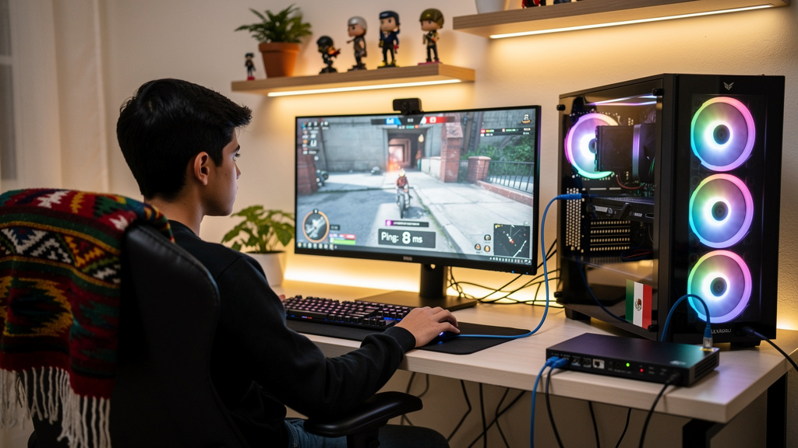

# ¿Cuánta Velocidad de Internet Necesitas en 2026? La Guía Real para México

Esta es la pregunta que todos hacen cuando van a contratar o cambiar de plan: ¿cuántos Mbps necesito realmente? La respuesta honesta es que la mayoría de los hogares mexicanos pagan por más velocidad de la que realmente necesitan, mientras que otros tienen conexiones que claramente no alcanzan. Esta guía te da los números reales.

---

## Velocidades Mínimas por Uso: La Tabla Directa

Antes de explicar el porqué, aquí tienes las cifras clave:

| Uso | Velocidad mínima recomendada |
|-----|------------------------------|
| Redes sociales y correo (1 persona) | 10 Mbps |
| Streaming HD (1 pantalla) | 15–25 Mbps |
| Streaming 4K (1 pantalla) | 25–50 Mbps |
| Videollamadas (Zoom, Teams, Meet) | 10–25 Mbps |
| Gaming online competitivo | 25 Mbps + latencia <50ms |
| Home office con videollamadas | 25–50 Mbps |
| Descargas de videojuegos (Steam) | 100+ Mbps para tiempos cómodos |
| Streaming en vivo (Twitch, YouTube) | 15–30 Mbps **de subida** |

**Regla rápida:** Para un hogar de 2–4 personas con uso mixto (streaming, trabajo, redes sociales), **50–100 Mbps son suficientes**. Los planes de 200 Mbps o más raramente hacen diferencia visible en el día a día.

---

## ¿Por Qué No Necesitas Más Mbps de los Que Crees?

La mayoría del contenido que consumes requiere mucho menos de lo que imaginas:

- **Netflix en calidad HD:** 5–7 Mbps por pantalla
- **Netflix en 4K:** 15–25 Mbps por pantalla
- **YouTube 1080p:** 5–8 Mbps
- **YouTube 4K:** 20–25 Mbps
- **Spotify/Apple Music:** 0.3–0.5 Mbps
- **Videollamada de Zoom (1:1):** 3–5 Mbps
- **Videollamada de Zoom (grupo, HD):** 10–15 Mbps

Una familia de 4 personas donde cada quien tiene su dispositivo haciendo estas cosas simultáneamente necesita aproximadamente:
- 2 pantallas Netflix HD: 14 Mbps
- 1 videollamada Zoom: 10 Mbps
- 2 dispositivos navegando/redes sociales: 5 Mbps
- **Total: ~30 Mbps**

Con 50 Mbps tienes margen cómodo. Con 100 Mbps tienes el doble de lo que necesitas. Con 200 Mbps estás pagando principalmente por tranquilidad (o por si alguien descarga juegos grandes frecuentemente).

---

## La Velocidad Que Realmente Importa: Velocidad Real vs. Velocidad Contratada

Aquí está el problema que muchos no consideran: la velocidad que contratas no es la que usas.

**¿Por qué hay diferencia?**

1. **Tecnología de red:** La fibra óptica entrega muy cerca de la velocidad contratada. El cable coaxial puede bajar a 40–70% de la velocidad contratada en horarios de alta demanda (7–11 PM).

2. **Tu router:** Un router de 5 años limitando a 2.4 GHz puede no pasar de 50 Mbps aunque tengas contratado 200 Mbps.

3. **WiFi vs cable:** WiFi agrega latencia y puede reducir la velocidad real en un 20–40% comparado con una conexión por cable Ethernet.

4. **Hora del día:** Los ISPs de cable comparten ancho de banda por zona. En horas pico (noche), la velocidad real puede caer significativamente.

**La prueba:** Haz un speed test en fast.com o speedtest.net a las 9 PM un martes. Esa es tu velocidad real. Si estás obteniendo 60% o menos de lo contratado, el problema no es el plan — es la tecnología o el equipo.

---

## Velocidad por Número de Personas en Casa

Esta tabla asume uso normal (no todos descargando simultáneamente):

| Personas | Uso típico | Velocidad recomendada |
|----------|-----------|----------------------|
| 1 persona | Streaming, trabajo básico | 25–50 Mbps |
| 2 personas | Streaming múltiple, videollamadas | 50–100 Mbps |
| 3–4 personas | Familia típica, gaming casual | 100 Mbps |
| 5+ personas | Familia grande, múltiples streamings 4K | 200–300 Mbps |
| Home office serio | Subidas de archivos grandes frecuentes | 100+ Mbps **simétrico** (fibra) |

**Nota importante:** Para trabajo desde casa con subidas de archivos grandes (diseñadores, videoconferencias frecuentes, respaldos en la nube), la **velocidad de subida** importa tanto como la de bajada. Aquí la fibra óptica supera al cable coaxial porque ofrece velocidades simétricas.

---

## ¿Cuántos Mbps Necesitas para Gaming?

Para gaming online, la velocidad de bajada es secundaria. Lo que realmente importa:

| Métrica | Para gaming básico | Para gaming competitivo |
|---------|-------------------|------------------------|
| Velocidad bajada | 15 Mbps | 25 Mbps |
| Latencia (ping) | < 80ms | < 30ms |
| Jitter | < 20ms | < 5ms |
| Pérdida de paquetes | < 2% | < 0.5% |

Un plan de 25 Mbps con 20ms de ping te dará mejor experiencia de gaming que 200 Mbps con 80ms de ping. Por eso Totalplay (fibra óptica, latencia promedio 26ms) es mejor para gamers que Izzi (coaxial, latencia >50ms) aunque Izzi pueda ofrecer la misma velocidad nominal.

> Lee: [Mejor Internet para Gaming en México 2026](/blog/mejor-internet-gaming-mexico-2026)

---

## Velocidades para Streaming 4K: Lo Que Netflix y YouTube No Te Dicen

Los requisitos oficiales de Netflix para 4K son 15 Mbps. La realidad es diferente:

- **Netflix 4K estable:** 15–25 Mbps (pueden bajar la calidad si hay congestión)
- **Netflix 4K sin compresión visible:** 25+ Mbps
- **YouTube 4K fluido:** 20–30 Mbps
- **Disney+ 4K:** 25 Mbps recomendado

Si tienes una TV de 55" o más y ves la diferencia entre 1080p y 4K, dale al menos 30 Mbps exclusivos para esa pantalla cuando estás viendo 4K. Con 100 Mbps en casa, puedes tener dos pantallas en 4K simultáneamente con margen.

---

## ¿Cuándo Sí Vale la Pena Contratar Más Velocidad?

Más velocidad tiene sentido real cuando:

- **Descargas juegos frecuentemente:** Un juego de 100 GB tarda 2.2 horas en 100 Mbps vs 44 minutos en 300 Mbps
- **Tienes 5+ personas o 10+ dispositivos simultáneos**
- **Eres creador de contenido** y subes videos de 1GB+ a YouTube/TikTok regularmente
- **Respaldas en la nube** grandes volúmenes de archivos frecuentemente
- **Tienes múltiples pantallas en 4K simultáneas** regularmente

Para el 80% de los hogares mexicanos, 100 Mbps son suficientes para 2026. Los que genuinamente necesitan más saben por qué.

---

## El Mito de "Más Mbps = Mejor Internet"

Hay un malentendido generalizado en México (y en todo el mundo) sobre cómo funciona la velocidad de internet: la idea de que más Mbps siempre significa mejor experiencia. Los ISPs aprovechan esta percepción para vender planes más caros que la mayoría de usuarios no necesitan.

La realidad es más matizada. La calidad de tu experiencia de internet depende de cuatro factores, no uno:

1. **Velocidad de bajada (Mbps):** Qué tan rápido llegan los datos a tu dispositivo. Esto afecta principalmente la carga de páginas, streaming y descargas.
2. **Velocidad de subida (Mbps):** Qué tan rápido salen los datos desde tu dispositivo. Crucial para videollamadas, streaming en vivo y respaldos en la nube.
3. **Latencia (ping, ms):** Qué tan rápido responde la red. Determinante para gaming, videollamadas y la sensación de "fluidez" al navegar.
4. **Estabilidad (jitter y pérdida de paquetes):** Si la conexión mantiene calidad constante o tiene fluctuaciones. El jitter alto arruina videollamadas aunque el ping promedio sea bajo.

Un plan de 50 Mbps con fibra óptica, buena latencia y alta estabilidad dará mejor experiencia cotidiana que un plan de 200 Mbps con cable coaxial congestionado y 80ms de ping.

**La velocidad es una parte del rompecabezas.** Esta guía te ayuda a entender cuánta velocidad necesitas realmente, pero recuerda que también importa qué tecnología de red te entrega esa velocidad.

---

## Preguntas Frecuentes sobre Velocidad de Internet

**¿Cuántos Mbps es suficiente para trabajar desde casa?**

Para trabajo desde casa típico (videollamadas, documentos en la nube, correo), 25–50 Mbps son suficientes. Si subes archivos grandes frecuentemente o tienes videollamadas de alta calidad 4+ horas al día, busca 100 Mbps con buena velocidad de subida — idealmente fibra óptica que da velocidades simétricas.

**¿Es mejor 100 Mbps con fibra óptica o 200 Mbps con cable coaxial?**

Para la mayoría de usos: 100 Mbps de fibra óptica. La fibra da esa velocidad de manera consistente, con menor latencia y mayor estabilidad. El cable coaxial de 200 Mbps puede ser 80–120 Mbps en horas pico. La diferencia real en el día a día favorece a la fibra.

**¿Cuántos Mbps necesito para Netflix 4K?**

Netflix recomienda 15 Mbps para 4K. En la práctica, 25 Mbps dedicados a esa pantalla te darán una experiencia más estable sin buffering. Si también tienes otros dispositivos usando internet simultáneamente, suma sus requisitos.

## Cómo Saber Si Estás Pagando Demasiado por Tu Plan

Sigue estos pasos para saber si tu plan actual es el correcto:

### Paso 1: Mide tu velocidad real

Haz la prueba en fast.com (de Netflix) o speedtest.net:
- A las **10 AM** en día de semana (debería estar cerca de tu velocidad contratada)
- A las **9 PM** en día de semana (tu velocidad real en horas pico)

Si en horas pico obtienes menos del 60% de lo contratado, tienes un problema de infraestructura o tecnología, no de plan.

### Paso 2: Calcula tu velocidad máxima utilizada simultáneamente

En el momento de mayor uso en tu casa (generalmente una noche entre semana), ¿qué están haciendo todos?

- Cuenta cuántas pantallas están viendo video y en qué calidad
- Cuenta cuántas personas están en videollamada
- Considera si alguien está descargando algo o en gaming

Multiplica según la tabla de velocidades de arriba.

### Paso 3: Compara con lo que pagas

Si tu velocidad calculada necesaria es 80 Mbps y tienes contratado 300 Mbps, estás pagando por el doble + de lo que necesitas. Considera bajar al plan de 100 o 150 Mbps y ahorrar $100–$200 pesos al mes.

Si tu velocidad calculada es 120 Mbps y tienes contratado 100 Mbps y experimentas lag o buffering, el plan no alcanza y vale la pena subir.

### Paso 4: Verifica el origen del problema antes de cambiar de plan

Antes de contratar más velocidad, comprueba:

- **¿Usas WiFi?** Prueba con cable Ethernet directo al router. Si la velocidad mejora dramáticamente, el problema es tu WiFi/router, no el plan.
- **¿Cuántos años tiene tu router?** Un router de 3+ años puede ser el cuello de botella.
- **¿Tu router es el que te dejó el ISP?** Los routers de ISP suelen ser de gama baja. Un router de $800–$1,500 MXN de marcas como TP-Link AX o ASUS puede hacer más diferencia que un plan más caro.

> Compara las opciones disponibles: [¿Cuánto Cuesta Internet en México en 2026?](/blog/cuanto-cuesta-internet-en-mexico-2026)

---

## ¿Los Mbps anunciados son los que realmente recibes?

No siempre. Con fibra óptica, generalmente recibes 80–95% de la velocidad contratada. Con cable coaxial en horas pico, puedes recibir 50–70% de la velocidad contratada. Haz un speed test en horario de alta demanda para saber tu velocidad real.
